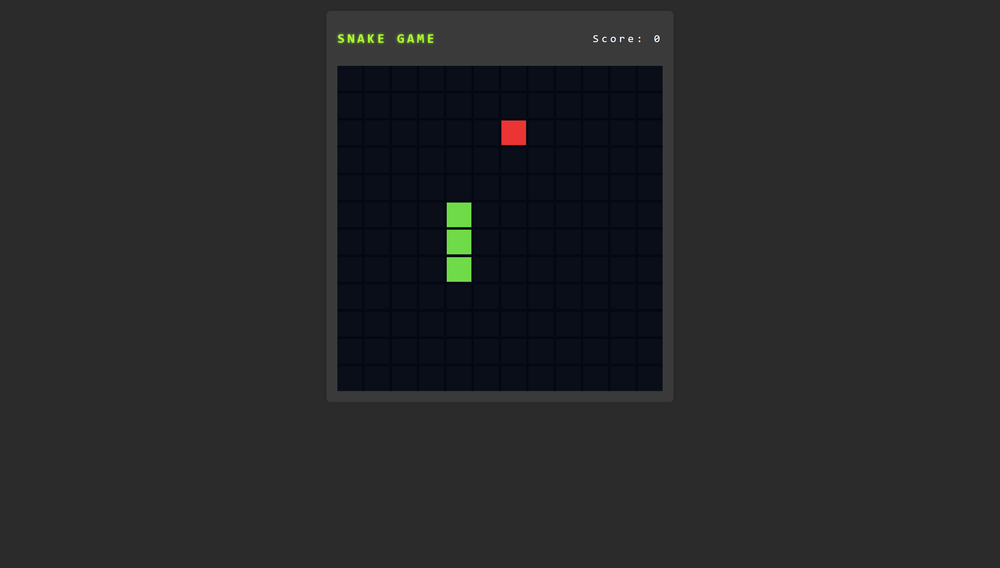

# 🐍 Snake Game

A modern take on the classic Snake game, built for the browser. Guide the snake to collect food, avoid hitting walls or itself, and rack up a high score!

**🔗 Live Demo**: [Snake Game](https://dobbyssockk.github.io/snake-game/)

---

## 🚀 Features

- Grid-based Snake gameplay with real-time movement
- Dynamic food placement and score tracking
- Game-over detection when hitting walls or self
- Sound effect on food pickup
- Keyboard control (arrow keys)
- Minimalist UI with modern layout

---

## 🛠️ Technologies Used

- **HTML5** – structure and semantic layout
- **CSS3** – responsive design and game board styling
- **JavaScript (Vanilla)** – game loop, logic, input handling, and rendering
- **Audio** – sound feedback when collecting food

---

## 💡 Key Concepts

- **Grid-based game logic**: board rendered with a fixed number of cells
- **Game loop mechanics**: using `setInterval` for continuous movement
- **Keyboard event handling**: arrow key inputs to steer the snake
- **Collision detection**: for boundaries and self-intersection
- **DOM manipulation**: dynamically updating cell classes
- **State management**: handling snake position, growth, score, and reset
